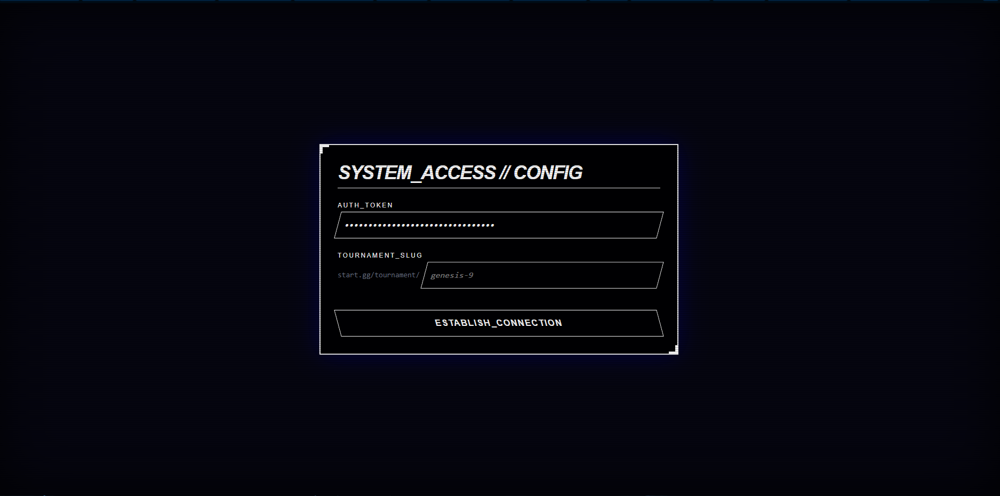
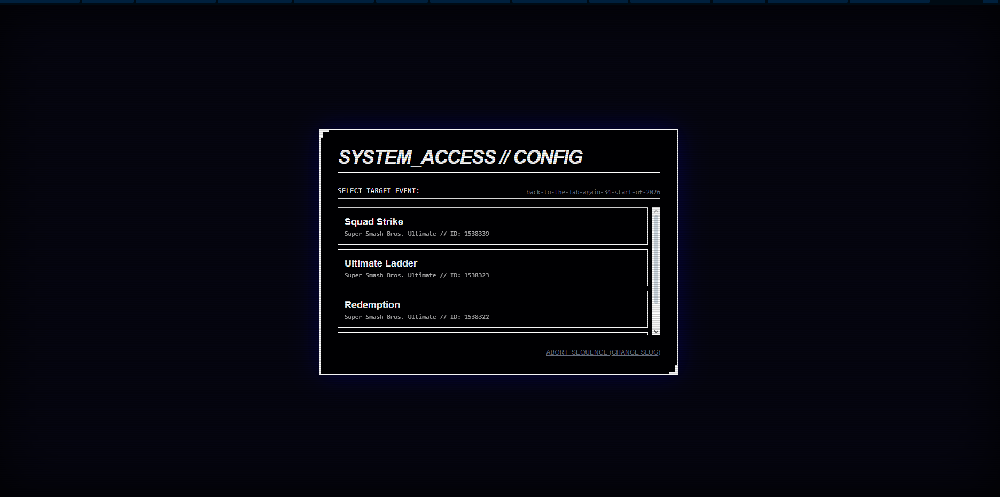
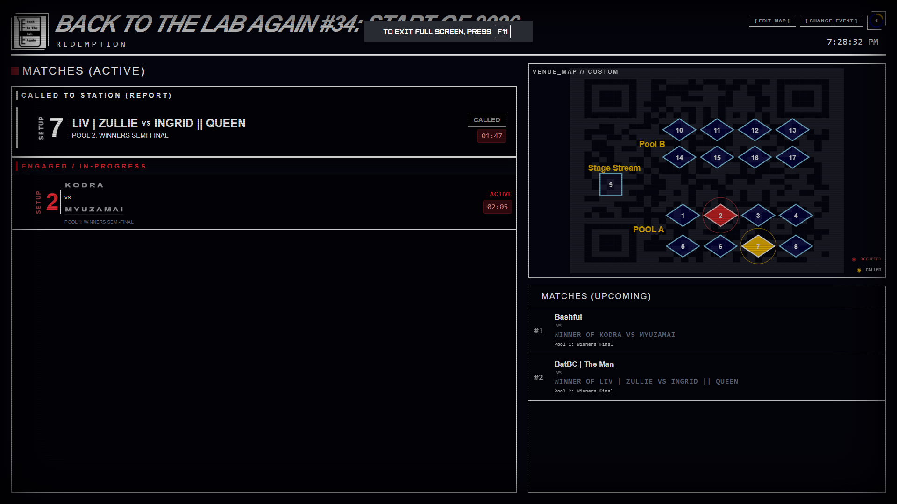
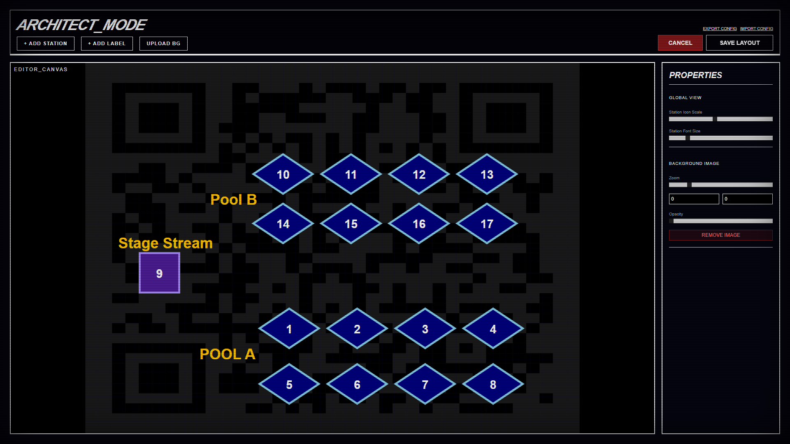

# █▓▒░ THE TERMINAL DASHBOARD ░▒▓█

> A simple, retro-styled tournament dashboard for Start.gg events.

**The Terminal** is a high-visibility venue display built with React, Tailwind CSS, and Electron. It pulls real-time bracket data from Start.gg to display "Active Matches" (Playing) and "On Deck" (Upcoming) sets.


## 📥 Download & Run (For Tournament Organizers)

You do **not** need to install code to use this. Just download the app:

1.  **[Click here to go to the Releases Page](https://github.com/enkabob64g/the-terminal/releases/latest)**.
2.  Download the latest **`.exe`** file (e.g., `The.Terminal.Setup.1.0.0.exe`).
3.  Run the installer.
4.  Launch the app from your Desktop!

---



## ⚡ Features

*   **Cyber Aesthetics:** Scanlines and monospace fonts for a 90s mainframe look.
*   **Desktop Application:** Standalone `.exe` for easy venue deployment.
*   **Venue Map System:** Built-in SVG Map Editor allows you to draw your venue layout, drag-and-drop stations, and visualize which setups are occupied or called in real-time.
*   **Auto-Scroll:**  Scrolls through matches when the list exceeds the screen height.

## 🎮 Usage Controls

*   **[ EDIT_MAP ]**: Opens the visual map editor. Right-click canvas to add stations.
*   **Timer Wheel**: Click to manually refresh data immediately.
*   **Auto-Scroll**: Automatically engages if the list is too long for the screen.


---

## 🛠️ Developer Setup (Source Code)

Only follow these steps if you want to modify the code or build the app yourself.

### 1. Clone the Repository
```bash
git clone https://github.com/Enkabob/the-terminal.git
cd Terminus-Dashboard-for-Start.gg-Events
```

### 2. Install Dependencies
```bash
npm install
```

### 3. Configure API Token
You need a Start.gg Auth Token to fetch data.
*   **Dev Mode:** Create a `.env` file in the root: `VITE_STARTGG_TOKEN=your_token_here`
*   **Production:** The app will prompt for a token or requires hardcoding in `App.jsx` before building.

### 4. Running the App
*   **Web Mode:** `npm run dev`
*   **Desktop Dev Mode:** `npm run electron:dev`
*   **Build .exe:** `npm run dist`

## 🧠 The "Deep Knowledge" Filter

To prevent the dashboard from getting cluttered with "TBD vs TBD" matches, this app uses a strict validation algorithm:

1.  **State 1 (Open):** ALWAYS SHOWN. These are playable matches.
2.  **State 5 (Pending):** ONLY SHOWN if we have "Deep Knowledge" of both sides.

**What is Deep Knowledge?**
*   **Level 1 (Entrant):** We know the player's name. (e.g. "Mang0") -> **VALID**
*   **Level 2 (Resolved Prereq):** We know the *two specific players* fighting in the previous set. (e.g. "Winner of Mang0 vs Zain") -> **VALID**
*   **Level 3 (Mystery):** We do not know who is fighting in the previous set. (e.g. "Winner of Winner of Bracket A") -> **HIDDEN**

## 📦 Tech Stack

*   **Core:** React (Vite)
*   **Desktop Wrapper:** Electron & Electron Builder
*   **Styling:** Tailwind CSS (v4)
*   **Data:** GraphQL (Start.gg API)

## 📄 License

MIT License. Hack away.

```
